Localisation
^^^^^^^^^^^^

Finally, we can run the actual localisation::

    arts_run_localisation --config R3.yaml --output_folder localisation_lowres --save_plots --verbose

The script generates a beam model for each SB, and compares the S/N according to the model to the measured S/N.
For SBs with a S/N below the threshold, the modelled S/N is only included if it is above the threshold. The differences
between the measured and modelled S/N are combined using a Chi-squared statistic. This results in a Chi-squared value
at each localisation grid point, with potentially a different number of degrees of freedom for each grid point as the
number of non-detection SBs in the model may vary over the localisation grid.

.. note::
    Any burst/CB combination for which an output file already exists is skipped

    It is possible to overwrite settings from the config file. Run ``arts_run_localisation -h`` for an overview of all options

Let's see the output of the localisation script:

.. code-block:: text

    (py36) leon@zeus:R3$ ls localisation_lowres/
    R3_20200511_3610_CB00_chi2.npy          R3_20200527_3437_CB00_chi2.npy          R3_20200528_2063_CB00_chi2.npy          R3_combined_bursts.pdf
    R3_20200511_3610_CB00_conf_int.npy      R3_20200527_3437_CB00_conf_int.npy      R3_20200528_2063_CB00_conf_int.npy      R3_coord.npy
    R3_20200511_3610_CB00.pdf               R3_20200527_3437_CB00.pdf               R3_20200528_2063_CB00.pdf               R3_localisation.npy
    R3_20200511_3610_CB00_snr_too_high.npy  R3_20200527_3437_CB00_snr_too_high.npy  R3_20200528_2063_CB00_snr_too_high.npy
    R3_20200511_3610_total_conf_int.npy     R3_20200527_3437_total_conf_int.npy     R3_20200528_2063_total_conf_int.npy

For each CB, these files are created:

* ``*_chi2.npy``: contains the Chi-squared values at each grid point, one file per CB.
* ``*_conf_int.npy``: contains the confidence interval at each grid point (i.e. a combination of the Chi-squared values and degrees of freedom).
* ``*snr_too_high.npy``: contains the grid points where the modelled S/N is highest in an SB that is *not* the main detection SB. By default, this array is not actually used during the localisation.
* ``*total_conf_int.npy``: contains the Chi-squared values of one burst, all CBs combined.
* ``*.pdf``: A visualisation of the confidence intervals for this burst.

Additionally, these files a created once:

* ``R3_coord.npy``: The RA, Dec coordinate grid corresponding to the localisation grid points.
* ``R3_localisation.npy``: The confidence interval of all bursts combined. This file also includes the coordinate grid.
  Load with something like ``RA, DEC, conf_int = np.load('R3_localisation')``
* ``R3_combined_bursts.pdf``: A visualisation of the confidence intervals of all bursts combined.

The burst figures look like this (click on a figure to make it bigger):

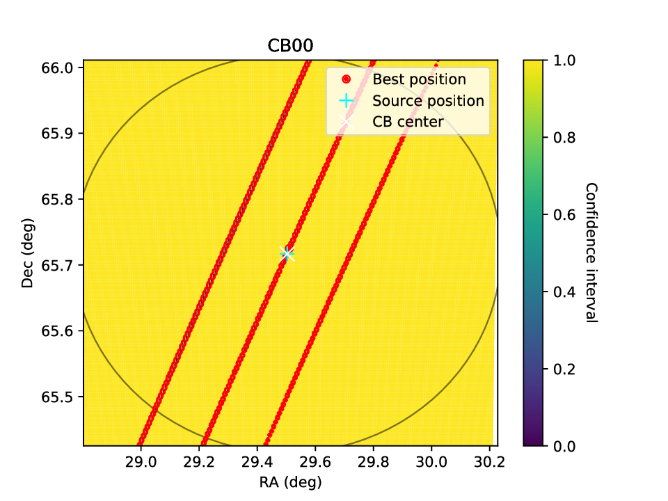

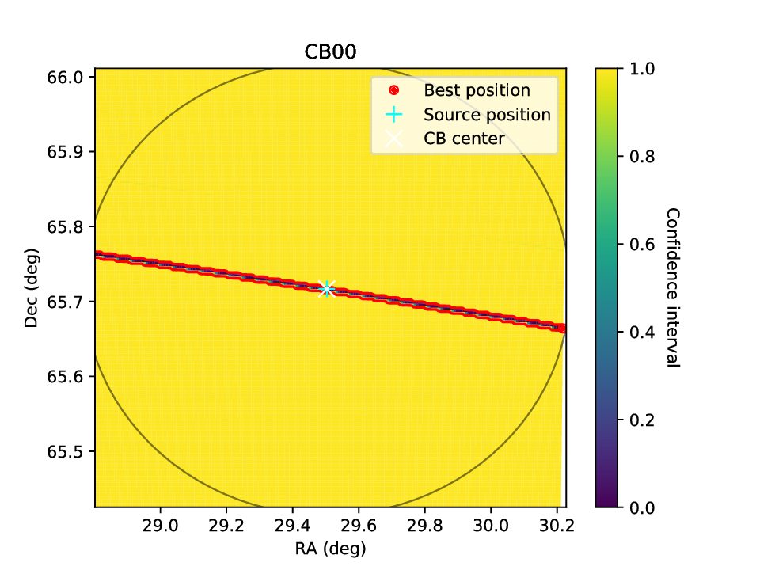

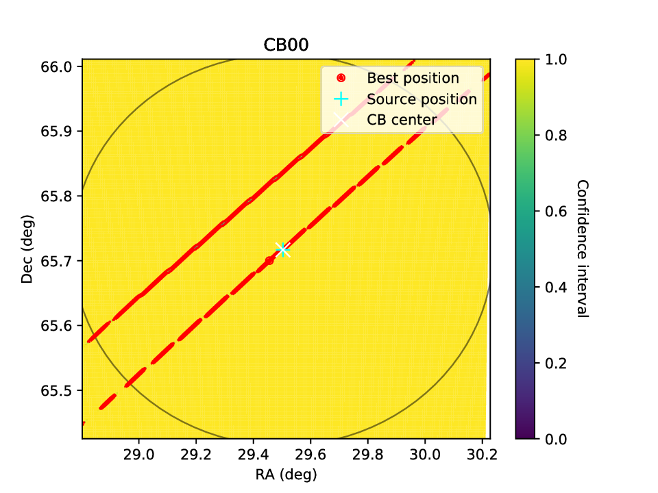

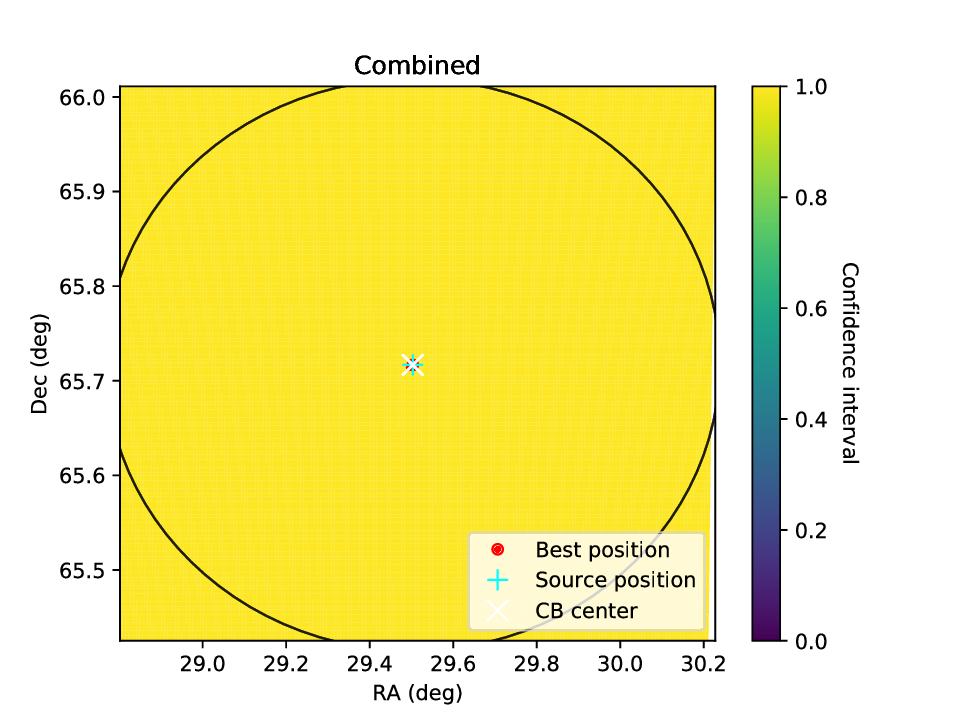

Note that a lower value is better in this case. By default, a 90% confidence interval is used for these figures.
This region is then given by all points with a value <= 0.10.
From especially the lower left plot, it is clear that the resolution is not high enough for proper localisation:
Along the major axis of the SB (from lower left to upper right in this case), there are gaps where the burst has a very
low probability, even though a single burst in a single CB can only be very coarsely localized along this axis.
For a single-CB detection, it may be very hard to do better. One could run a smaller localisation grid several times,
centred on different coordinates, and then combine the results. However, in this case we have multiple bursts.
While the combined results does not make sense yet (because the resolution is too low), we can estimate the real
burst position by overlapping the 3 individual burst figures: it must be near the centre.

In general, some experience is required to interpret these plots. For example, if the resolution is too low the result
may not even include a region that overlaps with the main detection SB. Currently, it is up to the user to recognize
and handle these issues.

We can now re-run the localisation at a higher resolution. The grid size is reduced to 10 arcminutes (from 35), which
allows us to increase the resolution to ~2 arcsec without a significant change in memory/computing load.
The localisation section of the config file now looks like this:

.. code-block:: yaml

    localisation:
        source_ra: 29.50333
        source_dec: 65.71675

        ra: 29.50333
        dec: 65.71675

        #size: 35
        #resolution: 10
        size: 10
        resolution: 2

        cb_model: gauss

Now the localisation can be executed again. The files are saved to a different folder, so the original, low-resolution output is not lost::

    arts_run_localisation --config R3.yaml --output_folder localisation_highres --save_plots --verbose

The figures now look like this (click on a figure to make it bigger):

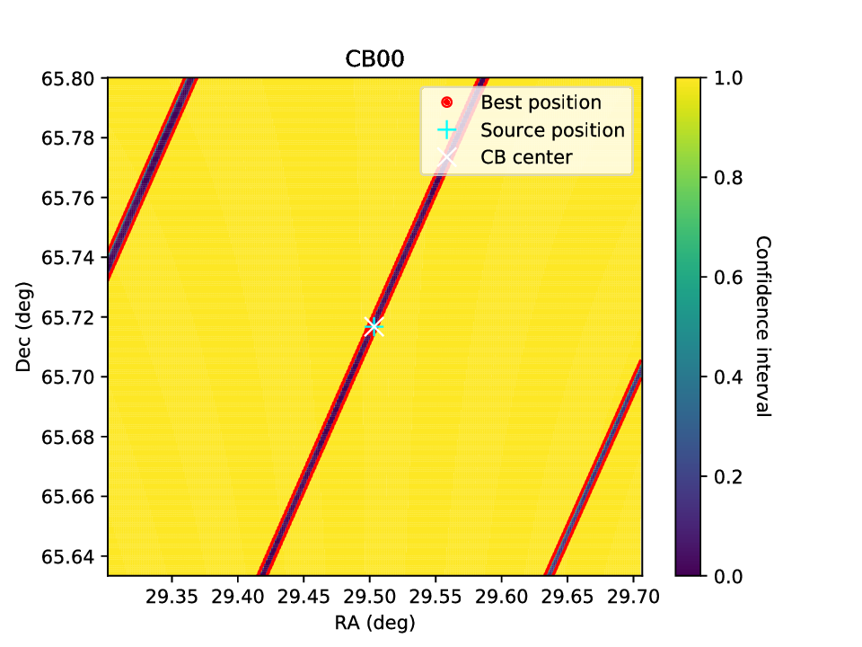

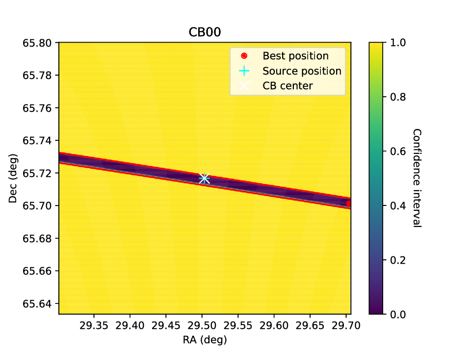

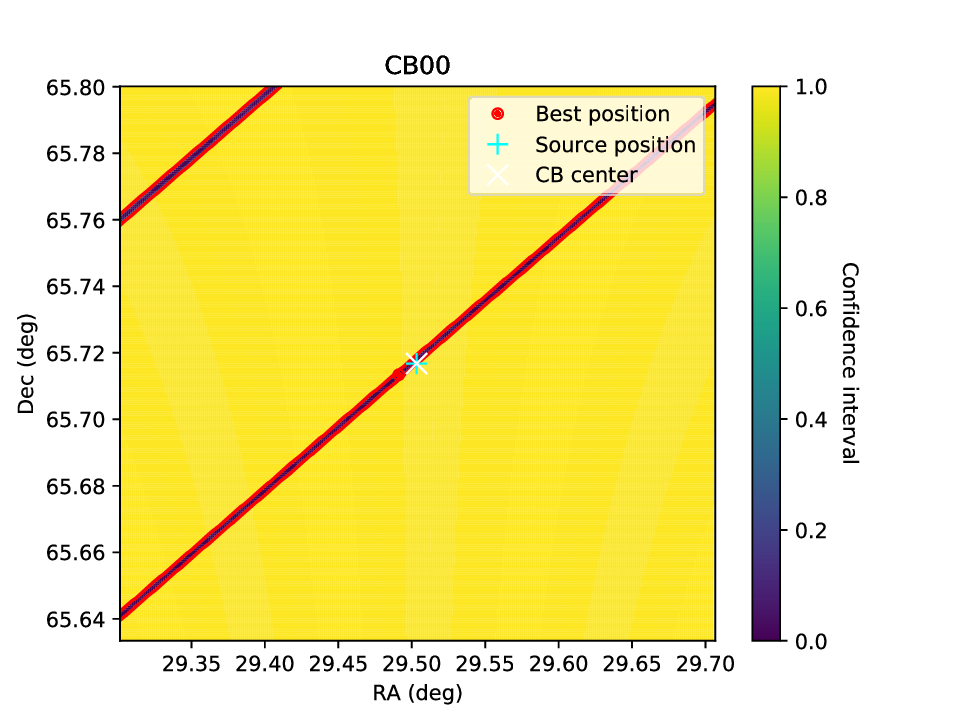

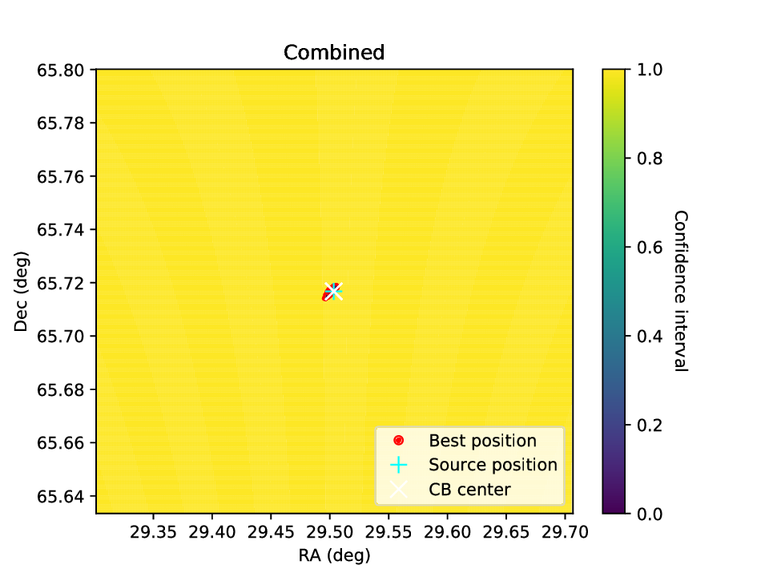

The figures now show clear, continuous localisation regions (although multiple regions are
still allowed for some bursts), and there is a final localisation region near the center of the CB.
The final localisation region is quite small, so let's zoom in one more time and again increase the resolution.

This time, the grid size is 1 arcminute and the resolution 0.1 arcsecond.

The output is as follows (click on a figure to make it bigger):

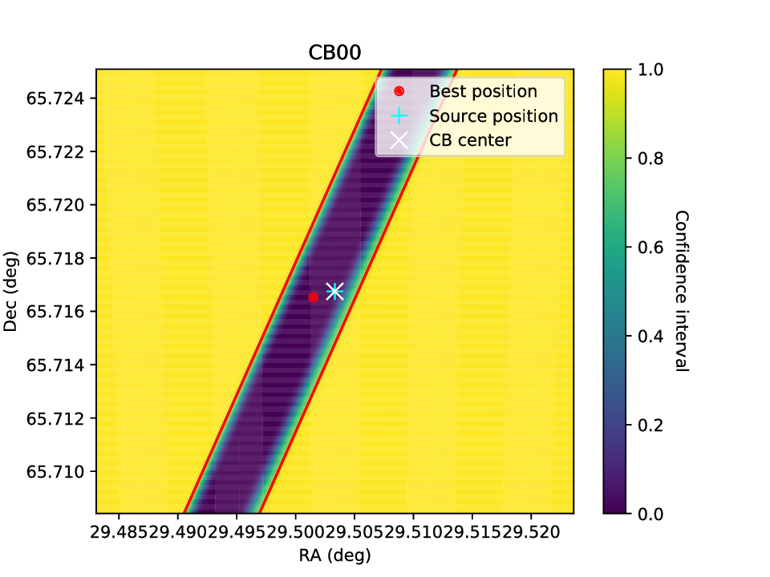

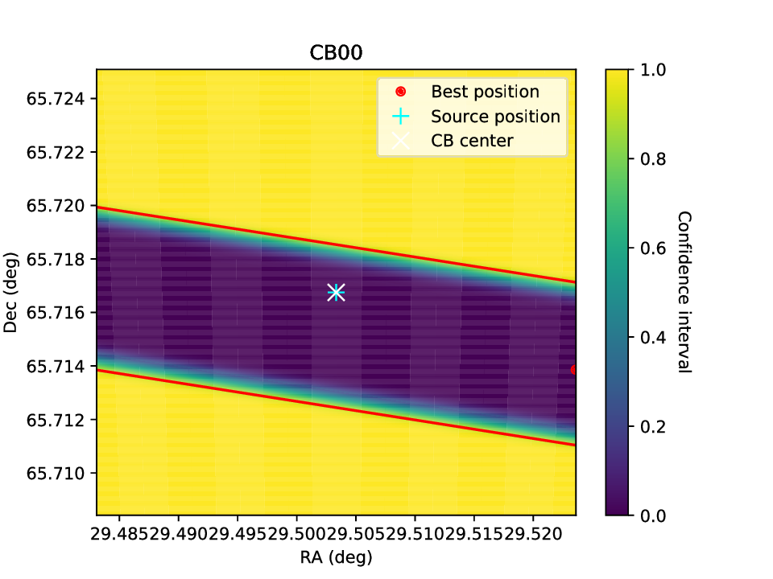

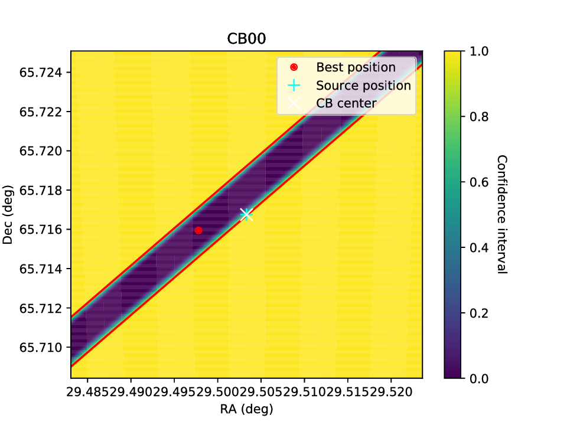

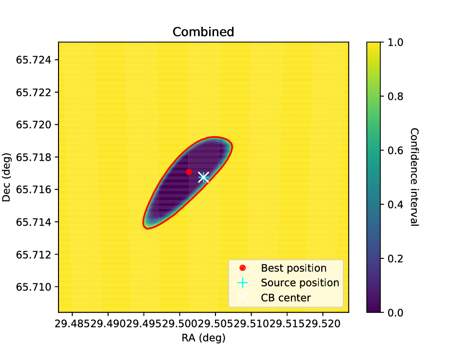

Now we can finally see the combined localisation region. The script prints some information about the localisation result:

.. code-block:: text

    INFO:arts_localisation.run_localisation:Localisation area is 1317.59 arcsec2 = 0.37 arcmin2
    INFO:arts_localisation.run_localisation:Best position: 01h58m05.6619s +65d42m49.9s
    INFO:arts_localisation.run_localisation:Source position: 01h58m00.7992s +65d43m00.3s
    INFO:arts_localisation.run_localisation:Separation: 31.749951562365375 arcsec
    INFO:arts_localisation.run_localisation:Confidence interval at source (lower is better): 0.00009

In this case, the final best position is 30 arcseconds from the known source position. The probability across a large
part of the localisation region is relatively constant: the real source position is also a very good fit at at 0.00009,
i.e. it would only be excluded if we would choose a 99.991% or higher confidence level.
For reference, the 0.37 square-arcminute localisation region corresponds to a circular region with a radius of 20 arcseconds.
