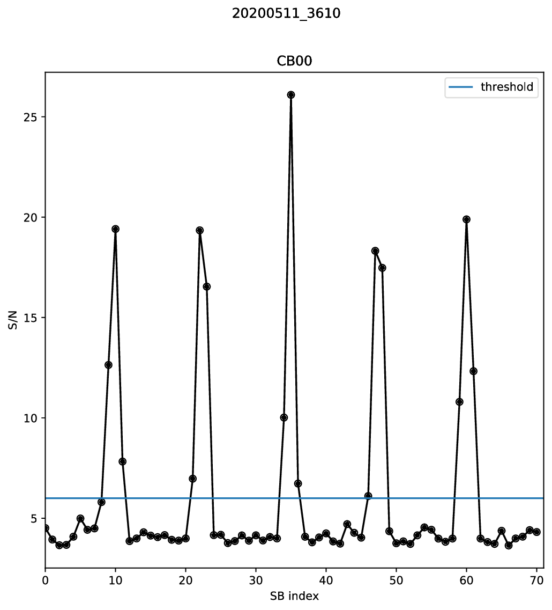

S/N measurement
^^^^^^^^^^^^^^^
The configuration file now contains all information needed to measure the S/N in each synthesised beam (SB)
of each CB of each burst. The following command executes the S/N calculation and creates some diagnostic plots::

    arts_calc_snr --config R3.yaml --output_folder snr --save_plots --verbose

The script loops over all bursts and CBs. First it determines the exact burst arrival time in the given CB/SB pair for each burst,
then it creates all SBs from the TABs and calculates the S/N using a matched filter. For each CB of each burst,
a text file is created containing the S/N in each SB. The S/N threshold set in the global
section of the configuration file is only used for visualisation, the script outputs the S/N in each SB,
even if it is below the threshold. The S/N determination can take quite some time, depending on the number of
beams. This example took 2.5 minutes on a high-end PC with the data on an SSD.

.. note::
    Any burst/CB combination for which an output file already exists is skipped

    It is possible to overwrite settings from the config file. Run ``arts_calc_snr -h`` for an overview of all options

Let's see what output the script produced::

    (py36) leon@zeus:R3$ ls snr
    R3_20200511_3610_CB00_SNR.txt  R3_snr_20200511_3610_CB00_SNR.txt  R3_snr_20200528_2063_CB00_SNR.txt
    R3_20200511_3610_SNR.pdf       R3_snr_20200511_3610_SNR.pdf       R3_snr_20200528_2063_SNR.pdf
    R3_20200528_2063_CB00_SNR.txt  R3_snr_20200527_3437_CB00_SNR.txt
    R3_20200528_2063_SNR.pdf       R3_snr_20200527_3437_SNR.pdf

There is a text file for each CB of each burst, and a pdf for each burst (multiple CBs would be combined into one figure).
As expected, the S/N is highest in the central SB, SB35::

    (py36) leon@zeus:R3$ sort -n -k 2 -r  snr/R3_20200511_3610_CB00_SNR.txt  | head -1
    35 26.09

The full array of SB vs S/N is shown in the figure:

Clearly, there is a periodicity in the S/N array. This is because the 71 SBs are generated from only 12 unique TABs.
For any broadband astrophysical signal, a periodicity of 12 SBs is expected in the S/N array. The S/N threshold seems
ok: It is below most clear detections, and above the noise level.
